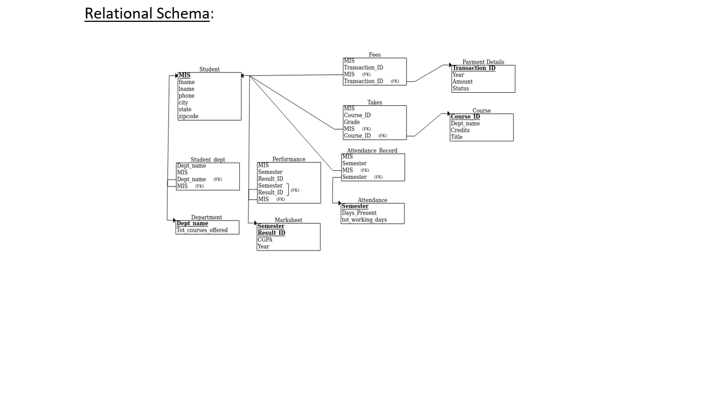

# Project: Student Registration Database

## Group: Aayush Yadav and Jinit Sanghvi
## MIS: 111803147 and 111803150

   Student registration database stores the information related to the students.
   The objective of this project is to design and implement a data model to effectively store all the information related to the students.   
   
   ## Functionalities:
   <ul>
      <li>Register new students.</li>
      <li>Record the attendance of students.</li>
      <li>Record the marks of students.</li>
      <li>Record the course details and subject information.</li>
      <li>Record the payment details of students.</li>
   </ul>

   User side features
   <ul>
   <li>Student can register himself/herself or login using MIS and password</li>
   <li>New student can register by filling out the personal details followed by academic details such as courses taken</li>
   <li>CGPA, semester and year and finally fee payment details</li>
   <li>After logging in student can view all the personal details on the sidebar while academic and payment details can be viewed in the center.</li> 
   <li>Registered students can register for new courses and enter attendance record as well as grades for different semesters</li>
   </ul>
   
   Admin side features
   
   <ul>
   <li>Deletion of records from the database</li>
   <li>Add new courses offered by the college into the database</li>
   <li>Update maximum number of working days in the semester</li>
   <li>Update student records in the database</li>
   </ul>

   Frontend used:
   
   <ul>
      <li>HTML</li>
      <li>CSS</li>
      <li>JS</li>
      <li>EJS</li>
   </ul>
   
   Backend used: 
   <ul>
      <li>NodeJS</li>
      <li>Express</li>
      <li>MySQL</li>
   </ul>
   
   How to run the code:
   <ol>
      <li>Install NodeJS</li>
      <li>On terminal, run command "node index.js"</li>
      <li>Open a browser</li>
      <li>Go to localhost:3000</li>
   </ol>
  
   
